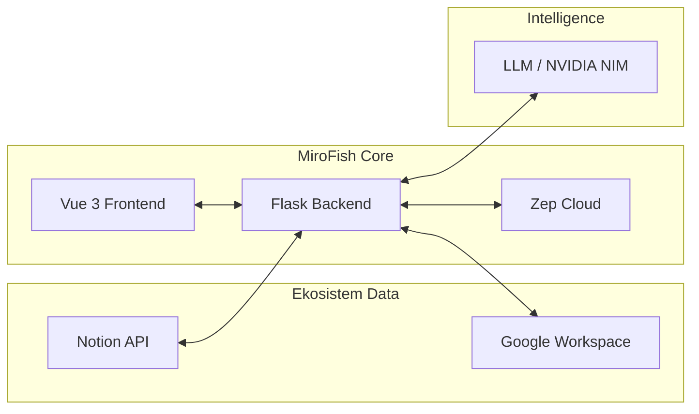
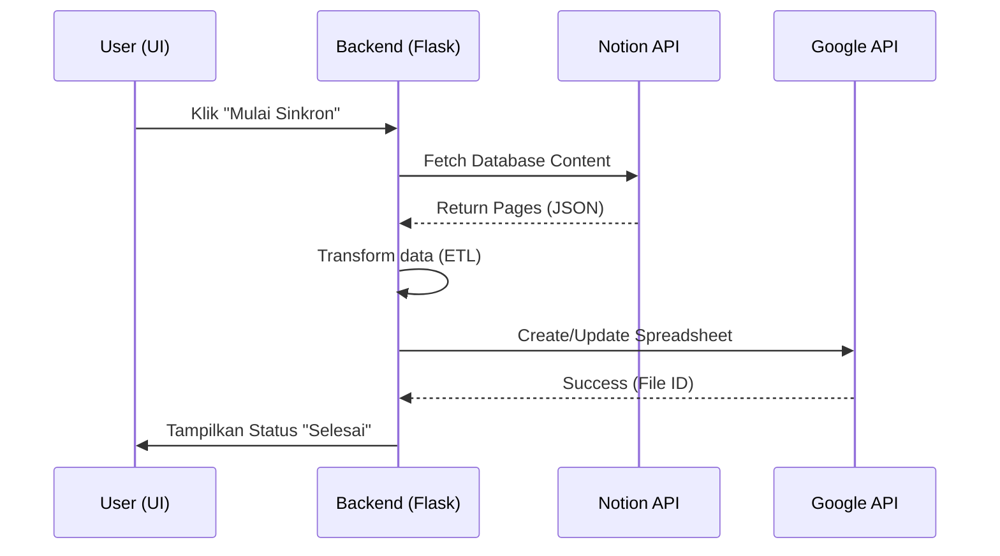

# Panduan lengkap — Mirofish-Psychology

Dokumen ini menjelaskan **seluruh alur**: pengembangan lokal, integrasi **Notion → Google Workspace**, API penelitian, serta **deploy ke GitHub dan Vercel** (frontend) + opsi hosting backend.

> **Upstream:** proyek ini berbasis [MiroFish (666ghj/MiroFish)](https://github.com/666ghj/MiroFish) (mesin simulasi multi-agent). Repo **Mirofish-Psychology** menambah lapisan PRD: sinkron data, analisis LLM, dan UI hub integrasi.

---

## Daftar isi

1. [Arsitektur](#1-arsitektur)
2. [Prasyarat](#2-prasyarat)
3. [Struktur repositori](#3-struktur-repositori)
4. [Instalasi lokal](#4-instalasi-lokal)
5. [Variabel lingkungan (`.env`)](#5-variabel-lingkungan-env)
6. [Notion — setup integrasi](#6-notion--setup-integrasi)
7. [Google Workspace — service account](#7-google-workspace--service-account)
8. [LLM (NVIDIA NIM / Qwen / lainnya)](#8-llm-nvidia-nim--qwen--lainnya)
9. [Zep Cloud](#9-zep-cloud)
10. [Menjalankan aplikasi](#10-menjalankan-aplikasi)
11. [API referensi (ringkas)](#11-api-referensi-ringkas)
12. [UI `/integration](#12-ui-integration)`
13. [Deploy ke GitHub](#13-deploy-ke-github)
14. [Deploy frontend ke Vercel](#14-deploy-frontend-ke-vercel)
15. [Deploy backend (produksi)](#15-deploy-backend-produksi)
16. [CORS & `VITE_API_BASE_URL](#16-cors--vite_api_base_url)`
17. [Pengujian otomatis (CI)](#17-pengujian-otomatis-ci)
18. [Troubleshooting](#18-troubleshooting)
2. [Alur Kerja Sinkronisasi](#2-alur-kerja-sinkronisasi)
3. [Prasyarat](#3-prasyarat)
4. [Struktur repositori](#4-struktur-repositori)
5. [Instalasi lokal](#5-instalasi-lokal)
6. [Variabel lingkungan (`.env`)](#6-variabel-lingkungan-env)
7. [Notion — setup integrasi](#7-notion--setup-integrasi)
8. [Google Workspace — service account](#8-google-workspace--service-account)
9. [LLM (NVIDIA NIM / Qwen / lainnya)](#9-llm-nvidia-nim--qwen--lainnya)
10. [Zep Cloud](#10-zep-cloud)
11. [Menjalankan aplikasi](#11-menjalankan-aplikasi)
12. [API referensi (ringkas)](#12-api-referensi-ringkas)
13. [UI `/integration](#13-ui-integration)`
14. [Deploy ke GitHub](#14-deploy-ke-github)
15. [Deploy frontend ke Vercel](#15-deploy-frontend-ke-vercel)
16. [Deploy backend (produksi)](#16-deploy-backend-produksi)
17. [CORS & `VITE_API_BASE_URL](#17-cors--vite_api_base_url)`
18. [Pengujian otomatis (CI)](#18-pengujian-otomatis-ci)
19. [Troubleshooting](#19-troubleshooting)
20. [Lisensi & atribusi](#20-lisensi--atribusi)

---

## 1. Arsitektur



- **Frontend:** Vue 3 + Vite + Tailwind (`frontend/`). Halaman khusus: `**/integration**` (wizard sinkron & uji API).
- **Backend:** Flask (`backend/`), port default **5001**.
- **Integrasi PRD:** modul Python di `backend/app/integrations/` dan blueprint `api/integration` + `api/research`.

---

## 2. Alur Kerja Sinkronisasi



---

## 3. Prasyarat


| Komponen     | Versi disarankan | Catatan                                                                                |
| ------------ | ---------------- | -------------------------------------------------------------------------------------- |
| Node.js      | 18+              | Build & dev frontend                                                                   |
| Python       | **3.11–3.12**    | Simulasi penuh + `camel-oasis` (via `uv sync`)                                         |
| Python 3.13+ | Terbatas         | Pakai `backend/requirements-minimal.txt` + tanpa simulasi OASIS penuh, atau **Docker** |
| `uv`         | Terbaru          | Instal backend resmi upstream (`npm run setup:backend`)                                |
| Akun         | —                | Notion, Google Cloud, LLM, Zep                                                         |


---

## 3. Struktur repositori


| Path                                        | Fungsi                                                               |
| ------------------------------------------- | -------------------------------------------------------------------- |
| `frontend/`                                 | UI Vue, `npm run dev` / `npm run build`                              |
| `backend/`                                  | API Flask, `python run.py` (dari folder backend dengan `PYTHONPATH`) |
| `backend/app/integrations/`                 | Notion + Google Workspace                                            |
| `backend/app/api/integration.py`            | Route sinkron & preview Notion                                       |
| `backend/app/api/research_api.py`           | Analisis, pertanyaan penelitian, LLM smoke                           |
| `backend/app/prd_assets/question_bank.json` | Contoh bank pertanyaan                                               |
| `locales/`                                  | Terjemahan UI (termasuk `id.json`)                                   |
| `DEPLOYMENT.md`                             | Ringkasan deploy (EN/ID campuran)                                    |
| `docs/PANDUAN_LENGKAP.md`                   | Dokumen ini                                                          |


---

## 4. Instalasi lokal

### 4.1 Clone

```bash
git clone https://github.com/biezz-2/Mirofish-Psychology.git
cd Mirofish-Psychology
```

### 4.2 Dependensi Node (root + frontend)

```bash
npm install
cd frontend && npm install && cd ..
```

### 4.3 Dependensi Python

**Opsi A — disarankan (Linux / WSL / Docker, Python 3.11–3.12):**

```bash
cd backend && uv sync && cd ..
```

**Opsi B — Windows / Python 3.14+ (API + PRD saja):**

```bash
cd backend
python -m venv .venv
# Windows:
.venv\Scripts\pip install -r requirements-minimal.txt
# Linux/macOS:
# .venv/bin/pip install -r requirements-minimal.txt
cd ..
```

### 4.4 File lingkungan

```bash
cp .env.example .env
# Edit .env — lihat bagian berikutnya
```

---

## 5. Variabel lingkungan (`.env`)

### Wajib untuk menjalankan backend (validasi upstream)


| Variabel         | Deskripsi                                                                        |
| ---------------- | -------------------------------------------------------------------------------- |
| `LLM_API_KEY`    | Kunci API LLM (format OpenAI-compatible)                                         |
| `LLM_BASE_URL`   | Base URL, contoh NVIDIA: `https://integrate.api.nvidia.com/v1` atau Qwen Bailian |
| `LLM_MODEL_NAME` | ID model, contoh `kimi-k2.6` atau `qwen-plus`                                    |
| `ZEP_API_KEY`    | Kunci Zep Cloud                                                                  |


### Opsional / PRD integrasi


| Variabel                         | Deskripsi                                                       |
| -------------------------------- | --------------------------------------------------------------- |
| `NOTION_API_KEY`                 | Internal integration secret dari Notion                         |
| `NOTION_DATABASE_ID`             | UUID database default (tanpa strip bisa, API menerima)          |
| `GOOGLE_APPLICATION_CREDENTIALS` | Path absolut ke file JSON **service account**                   |
| `GOOGLE_DRIVE_FOLDER_ID`         | Folder Drive tempat file baru dibuat (share folder ke email SA) |
| `SYNC_AUDIT_LOG_PATH`            | Opsional: path file log audit JSONL                             |


**Jangan** commit `.env` ke Git (sudah di `.gitignore`).

---

## 6. Notion — setup integrasi

1. Buka [Notion → My integrations → New integration](https://www.notion.so/my-integrations).
2. Beri nama, pilih workspace, **capabilities**: baca konten (sesuai kebutuhan database/halaman).
3. Salin **Internal Integration Secret** → `NOTION_API_KEY`.
4. Di halaman/database Notion: **⋯ → Connections** → hubungkan integrasi ini.
5. Salin **Database ID** dari URL:
  `https://www.notion.so/workspace/DATABASE_ID?v=...`  
   → `NOTION_DATABASE_ID`.

**Uji:** dari UI `/integration` klik **Preview Notion**, atau:

```bash
curl -s -X POST http://localhost:5001/api/integration/notion/preview \
  -H "Content-Type: application/json" \
  -d "{\"database_id\":\"YOUR_ID\"}"
```

---

## 7. Google Workspace — service account

1. [Google Cloud Console](https://console.cloud.google.com/) → buat/proyek pilih.
2. **APIs & Services → Library** — aktifkan: **Google Drive API**, **Google Docs API**, **Google Sheets API**.
3. **IAM → Service Accounts** → buat akun → **Keys** → Add key JSON → simpan aman.
4. Isi `GOOGLE_APPLICATION_CREDENTIALS` dengan path absolut ke file JSON tersebut.
5. Buat folder di Drive → **Share** → tambahkan email service account (format `...@...iam.gserviceaccount.com`) sebagai **Editor**.
6. Salin **Folder ID** dari URL Drive → `GOOGLE_DRIVE_FOLDER_ID`.

---

## 8. LLM (NVIDIA NIM / Qwen / lainnya)

Backend memakai klien **OpenAI SDK** (`backend/app/utils/llm_client.py`). Set:

```env
LLM_BASE_URL=https://integrate.api.nvidia.com/v1
LLM_API_KEY=nvapi-...
LLM_MODEL_NAME=<model-id-yang-didukung-NIM>
```

**Smoke test:**

```bash
curl -s -X POST http://localhost:5001/api/research/llm-smoke \
  -H "Content-Type: application/json" \
  -d "{\"prompt\":\"Reply with OK only\"}"
```

---

## 9. Zep Cloud

Daftar di [getzep.com](https://www.getzep.com/), buat project/API key → `ZEP_API_KEY`. Dipakai fitur memori/graf upstream.

---

## 10. Menjalankan aplikasi

### Satu perintah (perlu `uv` + deps terpasang)

```bash
npm run dev
```

- Frontend: `http://localhost:3000`
- Backend: `http://localhost:5001`

### Manual (minimal Python)

```bash
# Terminal 1 — dari folder backend, PYTHONPATH = folder backend
cd backend
set PYTHONPATH=%CD%          # Windows CMD
# export PYTHONPATH=$PWD    # Linux/macOS
.venv\Scripts\python run.py

# Terminal 2
cd frontend && npm run dev
```

---

## 11. API referensi (ringkas)


| Metode | Path                              | Fungsi                                               |
| ------ | --------------------------------- | ---------------------------------------------------- |
| GET    | `/health`                         | Health backend                                       |
| GET    | `/api/integration/config-status`  | Cek env terpasang (boolean, tanpa secret)            |
| POST   | `/api/integration/notion/preview` | Body: `{ "database_id": "..." }` opsional            |
| POST   | `/api/integration/sync/start`     | Mulai job sinkron Notion → Sheets (+ Doc opsional)   |
| GET    | `/api/integration/sync/<job_id>`  | Status job                                           |
| GET    | `/api/research/question-bank`     | Bank pertanyaan statis                               |
| POST   | `/api/research/analyze`           | Body: `{ "data": {...}, "write_google_doc": false }` |
| POST   | `/api/research/questions`         | Body: `{ "data": {...}, "methods": ["foq", ...] }`   |
| POST   | `/api/research/llm-smoke`         | Tes koneksi LLM                                      |


Blueprint upstream lain: `/api/graph/*`, `/api/simulation/*`, `/api/report/*`.

---

## 12. UI `/integration`

Buka `http://localhost:3000/integration` setelah frontend jalan. Fitur:

- Status koneksi (Notion / Google / LLM / Zep)
- Preview database Notion
- Mulai sinkron ke Google Sheets (buat spreadsheet baru jika tidak kirim `spreadsheet_id`)
- Job status polling
- Analisis & generator pertanyaan (JSON payload)
- LLM smoke

Bahasa UI: gunakan **Language switcher**; locale `id` digabung dengan fallback `en`.

---

## 13. Deploy ke GitHub

### 13.1 Repo kamu

- URL: `https://github.com/biezz-2/Mirofish-Psychology.git`

### 13.2 Remote lokal (setelah clone dari sumber lain)

```bash
git remote rename origin upstream   # opsional, simpan upstream 666ghj
git remote add origin https://github.com/biezz-2/Mirofish-Psychology.git
git push -u origin main
```

### 13.3 Autentikasi

- **HTTPS:** Personal Access Token (GitHub → Settings → Developer settings → Fine-grained atau classic `repo`).
- **SSH:** `git@github.com:biezz-2/Mirofish-Psychology.git` + kunci SSH.

### 13.4 Branch

- `**main`** — branch utama pengembangan & deploy Vercel (disarankan).

---

## 14. Deploy frontend ke Vercel

### 14.1 Prasyarat

- Akun [Vercel](https://vercel.com) (login dengan GitHub).
- Repo `Mirofish-Psychology` sudah ter-push.

### 14.2 Import proyek

1. Vercel Dashboard → **Add New… → Project**.
2. **Import** repositori `biezz-2/Mirofish-Psychology`.
3. Pengaturan build:
  - **Framework Preset:** Vite (atau Other)
  - **Root Directory:** `frontend`
  - **Build Command:** `npm run build`
  - **Output Directory:** `dist`
  - **Install Command:** `npm install` (default di subfolder sudah cukup)

### 14.3 Environment Variables (Vercel)

Tambahkan di **Settings → Environment Variables** (Production + Preview):


| Name                | Value                      | Catatan                                                                |
| ------------------- | -------------------------- | ---------------------------------------------------------------------- |
| `VITE_API_BASE_URL` | `https://URL-BACKEND-KAMU` | **Tanpa** trailing slash. Wajib jika backend tidak di domain yang sama |


Frontend memanggil `import.meta.env.VITE_API_BASE_URL || 'http://localhost:5001'` di `frontend/src/api/index.js`.

### 14.4 SPA routing

File `frontend/vercel.json` berisi rewrite ke `index.html` agar route seperti `/integration` tidak 404.

### 14.5 Deploy

Klik **Deploy**. Setelah selesai, buka URL Vercel → uji `/` dan `/integration`. Pastikan backend sudah online dan CORS mengizinkan origin Vercel (saat ini backend memakai CORS luas untuk `/api/*`; untuk produksi pertimbangkan membatasi origin di `backend/app/__init__.py`).

---

## 15. Deploy backend (produksi)

Flask **long-running** tidak cocok sebagai satu fungsi serverless Vercel klasik. Opsi umum:


| Platform                      | Ringkas                                               |
| ----------------------------- | ----------------------------------------------------- |
| **Railway / Render / Fly.io** | Deploy dari Dockerfile root repo (Python 3.11 + `uv`) |
| **Google Cloud Run**          | Container, set `PORT`, map ke `FLASK_PORT` jika perlu |
| **VPS**                       | `docker compose up -d`                                |


Set semua secret sama seperti `.env` di panel penyedia. **HTTPS** wajib untuk produksi.

---

## 16. CORS & `VITE_API_BASE_URL`

- Browser membuka `https://app-kamu.vercel.app` → request ke `https://api-kamu.com` = **cross-origin**.
- Backend harus mengirim header CORS untuk `GET/POST` ke `/api/*` (sudah diaktifkan secara luas).
- Jika API tetap ditolak browser, periksa: URL backend salah, mixed content (HTTPS page → HTTP API), atau firewall.

---

## 17. Pengujian otomatis (CI)

Workflow GitHub Actions (jika ada di repo): `**.github/workflows/ci.yml`**

- Build frontend
- `pytest` backend dengan `requirements-minimal.txt` pada Python 3.12

Jalankan lokal:

```bash
npm run test
```

---

## 18. Troubleshooting


| Gejala                                           | Kemungkinan                                        | Tindakan                                                |
| ------------------------------------------------ | -------------------------------------------------- | ------------------------------------------------------- |
| `403` saat `git push`                            | Bukan kolaborator repo / token salah               | Cek remote URL & PAT / SSH                              |
| Backend tidak start: `camel-oasis` install gagal | Python > 3.12                                      | Pakai Docker / Python 3.12 / `requirements-minimal.txt` |
| Notion `object_not_found`                        | Integration belum di-connect ke halaman            | Connect integration di Notion UI                        |
| Google `403` / `accessNotConfigured`             | API tidak diaktifkan / folder tidak di-share ke SA | Cek Library API & share Drive                           |
| Frontend `Network Error` di produksi             | `VITE_API_BASE_URL` kosong/salah                   | Set di Vercel, redeploy                                 |
| LLM `401`                                        | `LLM_API_KEY` atau `LLM_BASE_URL` salah            | Uji `/api/research/llm-smoke`                           |


---

## 19. Lisensi & atribusi

- Kode dasar MiroFish mengikuti lisensi **upstream** (lihat [LICENSE](https://github.com/666ghj/MiroFish/blob/main/LICENSE) di repo asli — AGPL-3.0).
- Perubahan Psychology/PRD dalam repo ini ditambahkan di atas basis tersebut; tetap hormati lisensi dan atribusi Shanda / CAMEL-OASIS sesuai README upstream.

---

**Pemeliharaan dokumen:** sesuaikan URL demo, tangkapan layar, dan penyedia backend ketika infrastruktur produksi sudah final.