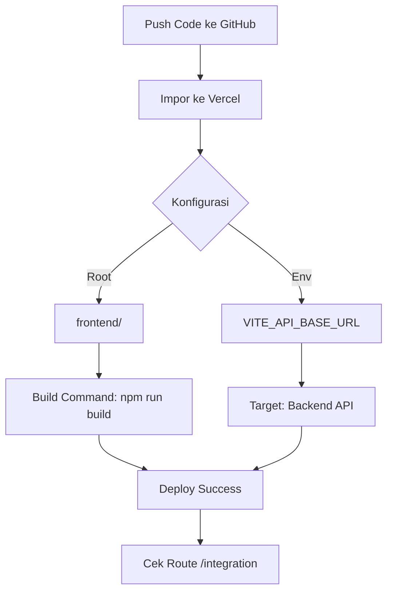

# Langkah deploy Vercel (frontend) — checklist

Ikuti urutan ini setelah kode sudah ada di GitHub [`biezz-2/Mirofish-Psychology`](https://github.com/biezz-2/Mirofish-Psychology).

## 🗺️ Alur Deploy

## 1. Login & import

1. Buka [vercel.com](https://vercel.com) → login dengan GitHub.
2. **Add New…** → **Project**.
3. **Import Git Repository** → cari **`Mirofish-Psychology`** → **Import**.

## 2. Konfigurasi build (penting)

| Field | Nilai |
|-------|--------|
| **Root Directory** | `frontend` (klik *Edit* jika default root repo) |
| **Framework Preset** | Vite (atau *Other* jika tidak terdeteksi) |
| **Build Command** | `npm run build` |
| **Output Directory** | `dist` |
| **Install Command** | biarkan default `npm install` (Vercel menjalankannya di dalam `frontend/`) |

File [`frontend/vercel.json`](../frontend/vercel.json) sudah mengatur **rewrite** ke `index.html` agar route Vue (mis. `/integration`) tidak 404.

## 3. Environment variables

Di **Settings → Environment Variables** (centang **Production** dan **Preview**):

| Name | Value contoh |
|------|----------------|
| `VITE_API_BASE_URL` | `https://backend-kamu.railway.app` atau domain API Flask kamu |

**Tanpa** slash di akhir. Tanpa variabel ini, build tetap sukses tetapi browser akan mencoba memanggil `http://localhost:5001` (salah di produksi).

## 4. Deploy

1. Klik **Deploy**.
2. Tunggu build hijau.
3. Buka URL preview → tes `/` dan `/integration`.
4. Buka **Network** di DevTools → pastikan request API mengarah ke domain backend yang benar.

## 5. Domain custom (opsional)

**Project → Settings → Domains** → tambah domain kamu → ikuti instruksi DNS.

## 6. Redeploy setelah perubahan env

Setiap mengubah `VITE_API_BASE_URL` → **Deployments → … → Redeploy** (agar nilai baru terbake ke bundle).

---

Detail tambahan: [PANDUAN_LENGKAP.md](./PANDUAN_LENGKAP.md) bagian *Deploy frontend ke Vercel*.
